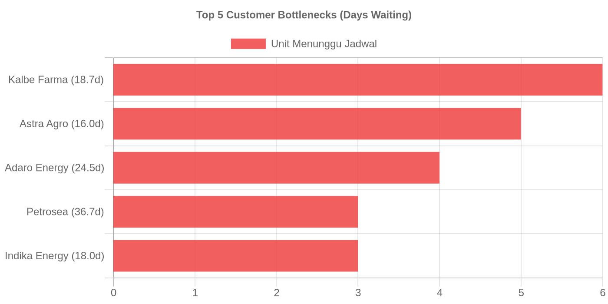
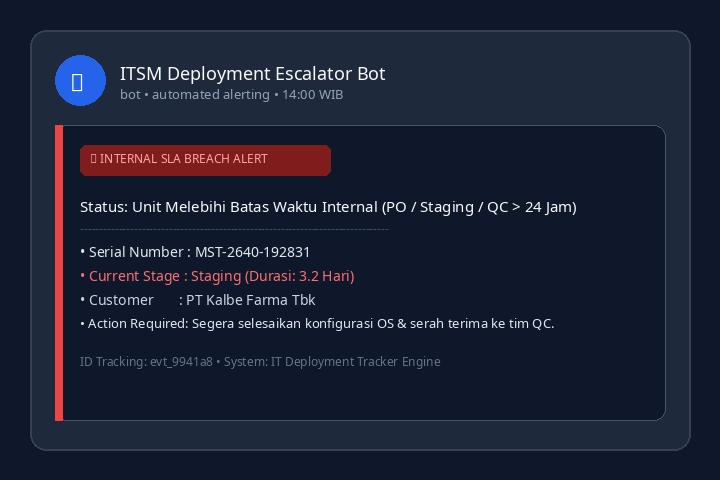
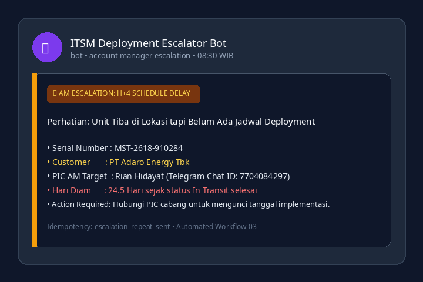

# 📦 IT Deployment Lifecycle & SLA Monitoring Pipeline

A robust PostgreSQL schema, event-sourcing tracking engine, and automated telemetry simulation designed to monitor end-to-end IT hardware deployment workflows (from PO receipt, staging, quality control, courier logistics, customer site scheduling, to final on-site handover).

Built to demonstrate **DevOps / Database Architecture / Operational Automation** practices with strict SLA validation and state-machine transitions.

---

## 🏗️ Architecture & State Machine

```
[ PO ] ──► [ Staging ] ◄─── (QC Rework)
                 │
                 ▼
              [ QC ]
                 │
                 ▼
       [ Ready to Delivery ]
                 │
                 ▼
           [ In Transit ] (Ekspedisi SLA tracking)
                 │
                 ▼
    [ Waiting Customer Schedule ] ◄─── (Reschedule)
                 │
        ┌────────┴────────┐
        ▼                 ▼
   [ Scheduled ]     [ On Hold ]
        │                 │
        ▼                 ▼
   [ Deployed ]      [ Scheduled ]
```

---

## ⚡ Key Engineering Highlights

1. **State Machine Integrity (`allowed_transitions`):**
   - Enforces valid transition paths so units cannot arbitrarily jump stages (e.g., from `PO` directly to `Deployed`).
2. **Event-Sourced Duration Metrics (`status_events`):**
   - Every status transition is logged with timestamp, previous stage, next stage, and operational notes.
   - Enables high-precision duration analytics per stage via SQL window functions (`LEAD()` / `LAG()`).
3. **Automated SLA Bottleneck Detection:**
   - Detects internal staging delays (>1 day).
   - Monitors vendor logistics and pickup thresholds (`max_ready_days`).
   - Flags customer scheduling bottlenecks (>3 days) to trigger Account Manager escalations.
4. **Hardened Docker Stack:**
   - Database bound to loopback `127.0.0.1:5432` to prevent external network exposure.
   - Zero hardcoded credentials (configured purely via `.env` with `.gitignore` sanitization).
   - Includes lightweight zero-config web viewer via `pgweb`.

---

## 🚀 Quickstart

### 1. Prerequisites
- Docker & Docker Compose
- Python 3.10+ (for generator script)

### 2. Environment Setup
```bash
cp .env.example .env
# Adjust credentials in .env if desired
```

### 3. Start Database Stack
```bash
docker compose up -d
```
- PostgreSQL: `127.0.0.1:5432`
- Database Web UI (`pgweb`): `http://localhost:8081`

### 4. Initialize Schema & Generate Realistic Telemetry Data
```bash
# Execute schema
docker exec -i postgres psql -U postgres -d maindb < schema.sql

# Run Python realistic data generator (150 units, 800+ events)
pip install psycopg2-binary python-dotenv
python generate_dummy.py
```

---

## 📊 Analytical Queries

### Unit Distribution per Stage
```sql
SELECT 
  sr.sort_order,
  sr.stage,
  sr.owner,
  COUNT(u.id) AS total_units
FROM stage_rules sr
LEFT JOIN units u ON u.current_stage = sr.stage
GROUP BY sr.sort_order, sr.stage, sr.owner
ORDER BY sr.sort_order ASC;
```

### Average Cycle Time per Stage (Days)
```sql
WITH stage_durations AS (
  SELECT 
    se.unit_id,
    se.to_stage AS stage,
    se.changed_at AS enter_time,
    LEAD(se.changed_at) OVER(PARTITION BY se.unit_id ORDER BY se.changed_at ASC) AS exit_time
  FROM status_events se
)
SELECT 
  sr.sort_order,
  sd.stage,
  COUNT(*) AS total_samples,
  ROUND(AVG(EXTRACT(EPOCH FROM (COALESCE(sd.exit_time, now()) - sd.enter_time)) / 86400)::numeric, 1) AS avg_duration_days
FROM stage_durations sd
JOIN stage_rules sr ON sr.stage = sd.stage
GROUP BY sr.sort_order, sd.stage
ORDER BY sr.sort_order ASC;
```

---

## 🤖 Modular REST API & n8n Automation Workflows

The engine is decoupled into a modular router-based FastAPI backend (`app/`) orchestrated by 5 automated n8n workflows:

### API Endpoints
- `GET /health` & `GET /metrics`: Service health check & end-to-end lead time analytics.
- `GET /units` & `POST /units`: Unit tracking & transition dispatching via state machine.
- `GET /units/alerts/internal`: Flags internal SLA breach (PO, Staging, QC > 24h) & idle courier pickup.
- `GET /units/reminders`: H+1 to H+3 client reminder queue with idempotency protection.
- `GET /units/escalations`: H+4 Account Manager escalation queue with 3-day repeat interval.
- `GET /units/summary/morning` & `GET /units/summary/weekly`: Executive morning recap & weekly management reporting.

### Automated n8n Workflows (`workflows/`)
1. **01 - Hourly Internal SLA Alert:** Hourly polling of internal bottlenecks with Telegram notifications.
2. **02 - Customer Schedule Reminder (H+1 to H+3):** Daily reminders sent to customer contacts.
3. **03 - Account Manager Escalation (H+4):** Dedicated escalation notices to AMs for stuck deployments.
4. **04 - Morning Operations Summary:** 07:30 WIB daily operations briefing.
5. **05 - Weekly Executive Narrative & Visual Report:** Automated weekly KPI summary with QuickChart visual bottleneck graphs.

### Visual Reporting & Automated Alerts Preview
| Weekly Management Bottleneck Chart |
| :---: |
|  |

| SLA Breach Alert (Workflow 01) | Account Manager Escalation (Workflow 03) |
| :---: | :---: |
|  |  |

---

## 📄 License
MIT License.
